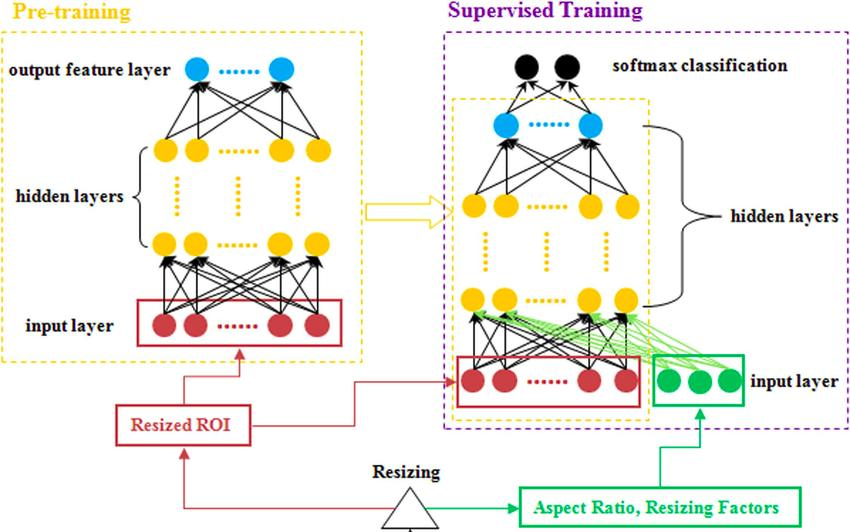
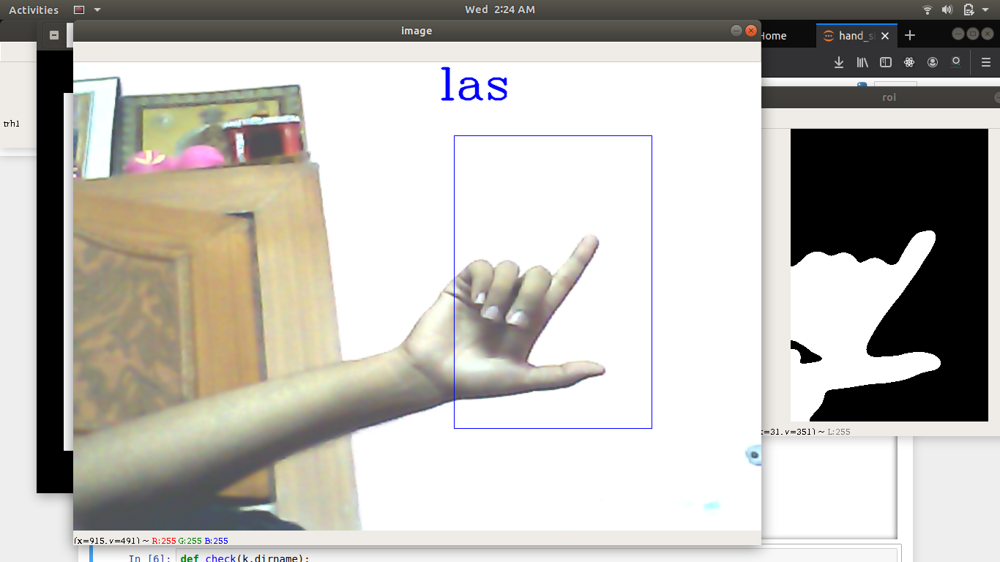
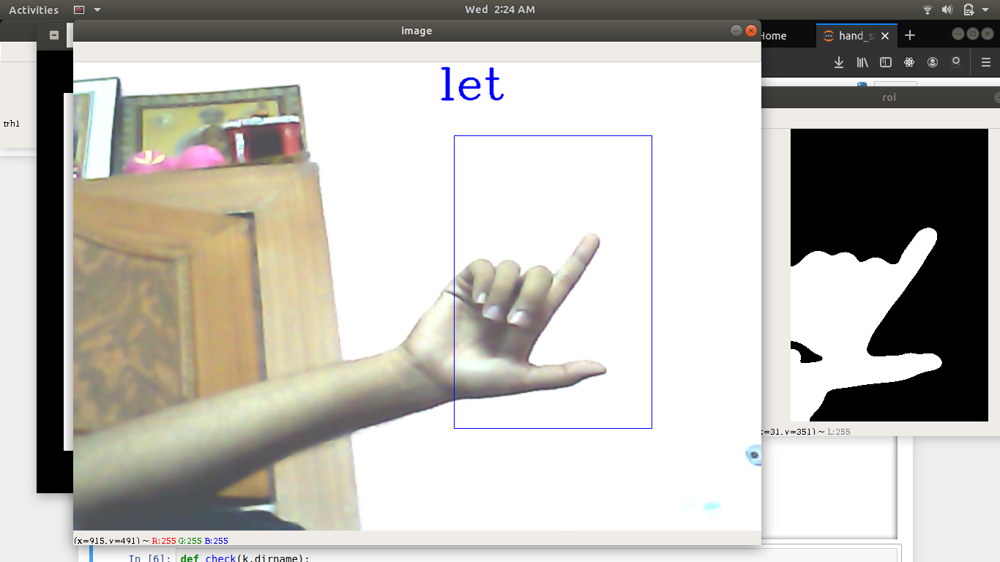

# Gesture_Recognition

This Repository is a project which involves recognition of Hand Gesture using Computer Vision.

This project aims to solve the problem for Deaf and Dumb People by using this technology they by just showing the gestures
Gestures can be converted into characters which can be used to form the words.

</img>

By using Computer Vision Technology I have used CNN which stands for Convolution Neural Network.

## Convolution Neural Network

CNN consists of Multiple Layers which can directly extract features from the Dataset in our case the dataset consists of
series of hand gestures namely from A-Z which consists of multiple folder each folder representing number of images about 
100-200 images per character. 

So, In General what CNN does is it extracts features from the images and the features are extracted by variety of layers
which is known to the network. It consists of several layers each layer have it's own function which basically reduces the
size of image by performing certain operations.

While creation of CNN I have used many layers for performing these operations which are:-

### Convolution Layer

This is the most important layer used by any CNN based Network which by using convolution operation between image and convolution filter is used to reduce the information that is not required by the network so it removes all of the information which is not required for learning of details by the model.

### BatchNormalisation Layer

This layer is generally used to normalize that is to reduce the redundant information from the images which basically removes all of the information which can act as noise while creation of network which can highly affect the accuracy of the Network.

### MaxPooling Layer

This layer is used to extract certain information which is most useful in the images which can be used to extract the information which can be served the most important part while recognizing any of the images.

### Activation Layer

Activation Layer is generally as function which can be used as an average operation of all of the functions.
I have used RelU and Softmax Function as a activation layer in my Neural Network In which ReLU serves as the Rectifier function which involves giving positive values always for all positive values of x and then Softmax function is used to identify whether the output is in the form of integers. 

### Dense Layer 

This layer serves as Neural Network Fully connected layer which is used to pass input from all of the above layer to this dense function where we can set number of neurons and number of layers which can be used to serve the purpose of the Neural Network. 

While building this Neural Network I have used certain hyperparameters such as batch_size, epochs and the image size which can be used for training and testing as 28 * 28.

Here is the flow diagram Representing the whole process:-

</img>

# Training Phase

Training Phase involves certain steps first is creation of data I have used my own custom dataset which is in the form of binary images which I will share later. This creation of binary images involved creation of images which consists of removal of background that is extraction of hand gestures from the images which involves background noise removal, binary image creation and then saving the images which are extracted from the frames.

Some of the training images which are generated after binary conversion are:-

</img>

</img>

# Testing Phase

After Training the same amount of images are tested with the model on the same dataset of images thereby giving the accuracy of about 90% that is 90% of images are correctly predicted.

# Hand Gesture Recognition + Recommendation

I have tried to merge recognition and Recommendation system both altogether in one system through which my model can correctly predict the characters as well then giving them correct recommendation of words so for the genral workflow i have used textgenrnn for creation of Recommendation system through which I have used an inbuilt dataset to train that generator RNN network for recommending a certain 3 character word from the character once it's been identified. So, as part of it the full workflow that I have been able to create is recognition of character with 90% accuracy then recommending a word from a character to generate a word from it which can be used by deaf and dumb to use my network in order to train the set of images.

</img>
</img>

# Result 

Here is the resulting video that I have created for my system which is able to correctly identify the words and then generate the Words from the model.

